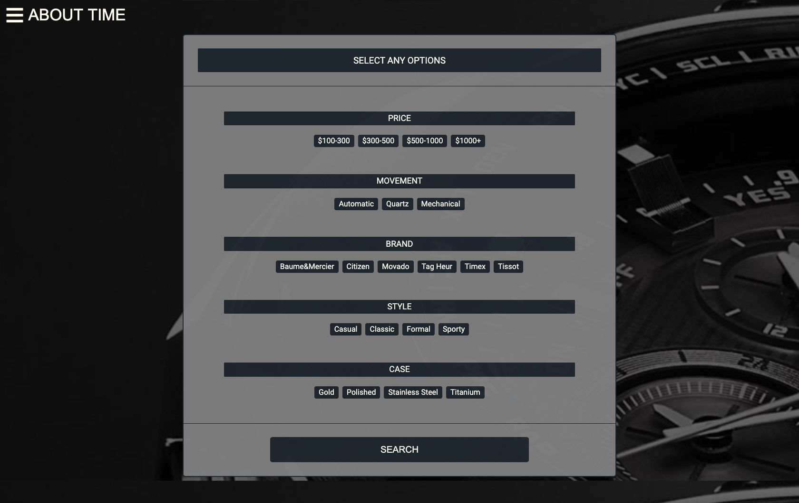

# About Time

[Check out the app here.](https://about--time.herokuapp.com/)

About Time is a web application which provides individualized watch curation, and generates recommendations based on user selected preferences.

When searching for a watch, either for yourself or as a gift, there are several factors which go into the decision. The abundance of options on large online shopping sites can be overwhelming to go through. Additionally, articles written on watch websites usually take only one or two parameters into account, then list the writer's top choices, without involving any user selection.

About Time will take all of your criteria into account through a simple set of questions, then present you with a curated short list of watches to choose from. It's About Time!

This project was a group exercise to explore a completely new backend stack, reinforce our mastery of populer frontend frameworks, and learn to utilize Git as a team for group coordination and version control.


## Features
#### Search the curated watch database for recommendations matching your criteria.


#### Implementation:
Regular Expressions and Express.js are used to create the watch search API endpoint.
```
router.post("/search", (req, res) => {
  let query = {}
  if (req.body.brand) query.brand = req.body.brand;
  if (req.body.style) query.style = {'$regex': req.body.style, '$options': 'i'};
  if (req.body.gender) query.gender = {'$regex': req.body.gender, '$options': 'i'};
  if (req.body.movement) query.movement = {'$regex': req.body.movement, '$options': 'i'};
  if (req.body.case) query.case = {'$regex': req.body.case, '$options': 'i'};
  if (req.body.price === "100-300") {query.price = { $gte: 100, $lte: 300 }}
  else if (req.body.price === "300-500") {query.price = { $gte: 300, $lte: 500 }}
  else if (req.body.price === "500-1000") {query.price = { $gte: 500, $lte: 1000 }}
  else if (req.body.price === "1000+") {query.price = { $gte: 1000 }}

  Watch.find( query )
    .then(watches => res.json(watches))
    .catch(err => res.status(404).json({ nowatchesfound: "No watches found" }));
});
module.exports = router;
```
___
#### Didn't find what you wanted and want to repeat your search when new watches are added to the database? Search queries can be saved and re-run from the user profile page.

#### Implementation:

The ```searchesReducer``` captures the incoming search query and transcribes the query parameters to the Redux store/application state.
```
const searchesReducer = (state = { all: [], user: {}, new: undefined }, action) => {
    Object.freeze(state);
    let newState = Object.assign({}, state);
    switch (action.type) {
        case RECEIVE_SEARCH:
            newState.all = action.search.data;
            return newState;
        case RECEIVE_NEW_SEARCH:
            newState.all.push(action.search.data);
            newState.new = undefined;
            return newState;
        case RECEIVE_USER_SEARCHES:
            newState.all = action.searches.data
            return newState;
        case RECEIVE_WATCHES:
            newState.new = action.query
            return newState;
        case REMOVE_SEARCH:
            let searches = newState.all.filter(search => {
                return search._id !== action.searchId
            })
            newState.all = searches;
            return newState;
        default:
            return state;
    }
};
```
Then if the user chooses, the search criteria can be submitted to the backend API endpoint to be saved in the user's search history. API endpoint as follows:
```
router.post(
  "/",
  passport.authenticate("jwt", { session: false }),
  (req, res) => {
    User.findById(req.user.id, (err, user) => {
      let newSearch = {
        label: req.body.label,
        query: req.body.query
      };
      user.searches.push(newSearch);
      user.save()
        .then(user => res.json(newSearch))
        .catch(err => res.status(403).json(err));
    })    
  }
);
```
___
#### View watch details in a lightweight multi-purpose modal system that allows for a seamless browsing experience and enables non-disruptive user authentication.

#### Implementation: 
React Modal component is as follows:
```
function Modal({ modal, closeModal, currentWatch }) {
  if (!modal) {
    return null;
  }
  let component;
  switch (modal) {
    case "login":
      component = <LoginFormContainer closeModal={closeModal} />;
      break;
    case "signup":
      component = <SignupFormContainer />;
      break;
    case "show-watch":
      component = <WatchShowModalContainer currentWatch={currentWatch} />
      break;
    default:
      return null;
  }
  return (
    <div className="modal-background" onClick={closeModal}>
      <div className="modal-child" onClick={e => e.stopPropagation()}>
        {component}
      </div>
    </div>
  );
}

const mapStateToProps = state => {
  let showWatch
  state.watches.forEach(watch => {
    if (watch._id.toString() === state.ui.currentWatch) showWatch = watch
  })

  return {
    modal: state.ui.modal,
    currentWatch: showWatch
    // currentWatch: state.watches[state.ui.currentWatch]
  };
};

const mapDispatchToProps = dispatch => {
  return {
    closeModal: () => dispatch(closeModal())
  };
};
```

___

## Technologies
This project was built using the MERN stack: 
- Mongoose/MongoDB Atlas
- Express.js
- React, Redux
- Node.js

Passport.js was used to implement user authentication using a JSON Web Token.

## Group Members and Responsibility Breakdown

* Jaydip Dalal **(Team Lead)**

* Abel Chiao **(Backend Lead)**

* Aya Shirai **(Frontend Lead)**

* Phillip Hetzel **(Flex)**
